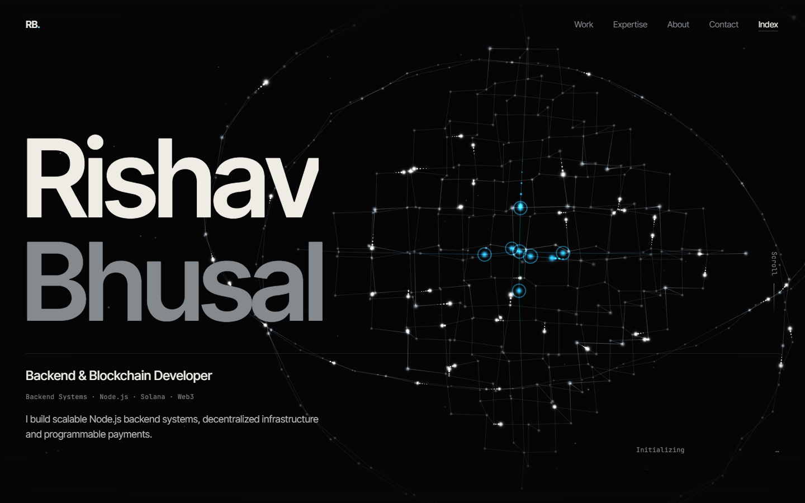
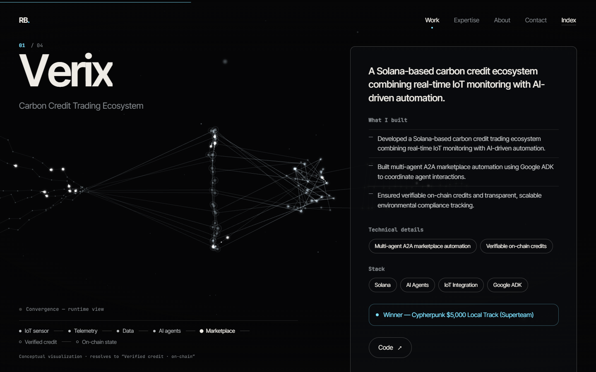
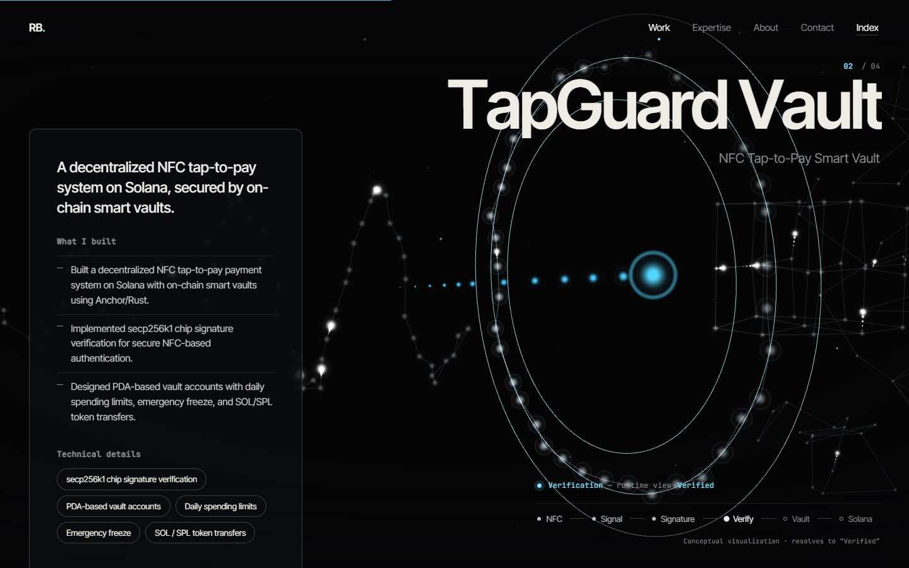
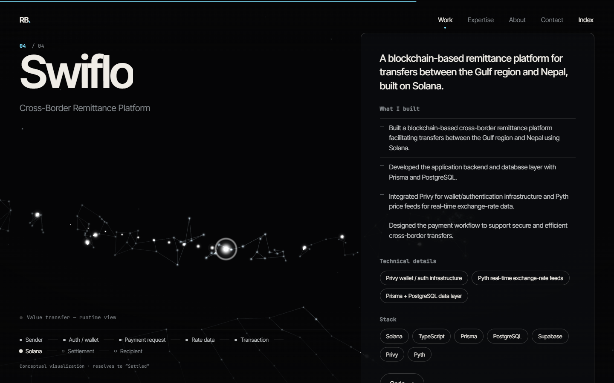
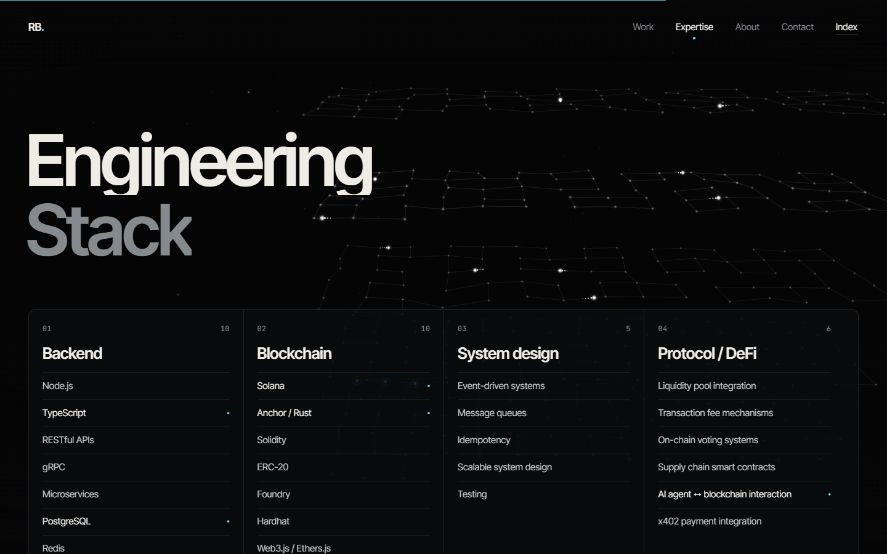

# Rishav Bhusal — Portfolio

Portfolio of Rishav Bhusal, a backend and blockchain developer working with Node.js, Solana and Web3.

Built with React, TypeScript and Three.js. The 3D background is a procedural node network that changes with each project.

## Projects

| Verix | TapGuard Vault |
| --- | --- |
|  |  |

| Swiflo | Engineering stack |
| --- | --- |
|  |  |

## Built with

React · TypeScript · Vite · Three.js · React Three Fiber · Anime.js · StringTune

## Links

- GitHub: https://github.com/Rishavbhusal
- LinkedIn: https://www.linkedin.com/in/rishav-bhusal-b0854a287
